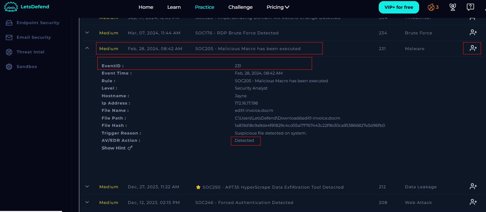

# SOC205---Malicious-Macro-has-been-executed

# Introduction
A malicious macro refers to a macro script embedded within a document (usually Microsoft Office files like .doc, .docm, .xls, or .xlsm) that performs harmful actions when the document is opened and macros are enabled.

## Investigation & Remediation
To investigate and remediate the alert, I took the following steps;
 - Check SOC ticket queue & Take ownership of an Alert
 - Create case
 - Understanding the attack
 - Detection
 - Analysis
 - Containment
 - Remediation
 - Report Artifacts & IOCs
 - Close ticket

These steps are expalined in details below with images.

## Step 1: Checking SOC Ticket Queue
The Security Operations Center (SOC) ticket queue is a critical component in managing and responding to cybersecurity incidents. The reasons are Incident Tracking and Management, Prioritization and Triage, Accountability, Reporting, Trend Analysis, and Compliance and Audit Readiness.

Each ticket in the queue is typically assigned to a specific analyst or team, ensuring clear responsibility and accountability for incident resolution. This fosters a structured and organized approach to incident management. I took ownership of the Alert with EventID: 231
 

  

 

  

## Step 2: Creating a Case
Upon taking ownership of the alert, it is automatically sent to the investigation channel, where I can initiate a case to further analyze and respond to the security incident. I created a case for the alert and was able to veiw details of the incident. 
 

  

## Step 3: Detection
Based on the information that the alert provided, it appears that the host "Jayne" with IP address "172.16.17.198" downloaded a malicious file with filename "edit1-invoice.docm" and file hash "1a819d18c9a9de4f81829c4cd55a17f767443c22f9b30ca953866827e5d96fb0a" to the path "C:\Users\LetsDefend\Downloads\edit1-invoice.docm". The Alert is triggered by the SOC205 - Malicious Macro has been executed and was detected by AV/EDR solution.

  

To gather Information as regards the file ""edit1-invoice.docm" and file hash "1a819d18c9a9de4f81829c4cd55a17f767443c22f9b30ca953866827e5d96fb0a", I used Ciscotalos and Virustotal to gather information as regards the nature of the downloaded Macro using the file hash.

  

Next, I carried out threat intelligence using the threat Intelligence platform provided by LetsDefend which provides a comprehensive database dedicated to cataloging maliciously used information, such as IP addresses, domains, and other indicators of compromise using the source IP address of 203.160.68.12. 

  

Additionally, I used VirusTotal for threat intelligence on the same IP address and observed that the malware was flaged for malicious activities by 4 security vendors and the Geolocation of the IP is Hong Kong. 

  

This confirms that the traffic from the IP 203.160.68.12 is Malicious. Hence, the need for me to carry out further investigation by analyzing the logs to see how many hosts in my network have ahd any communication with this malicious IP. 

## Step 4: Analysis
I started my analysis by investigating the access logs. Focusing on IP addresses, user-agents, paths, HTTP status codes, and timestamps to help me identify any suspicious or malicious activity.

Before examining the HTTP traffic, I investigated the payloads used in exploiting the relevant vulnerability. I found this publicly available POC (Proof of Concept) used by [CVE-2024–24919] in this github repository https://github.com/seed1337/CVE-2024-24919-POC/blob/main/exploit.py 

  

Next, I proceeded to the log management page and filtered by log by the malicious source IP address 203.160.68.12 to see how many host have been in contact with it. Upon searching the network, I discovered only the host named “CP-Spark-Gateway-01” with an IP address of 172.16.20.146 has been in contact the the malicious IP.

  

The Log information below, shows that the malicious IP address 172.16.20.146 used the POST method to send the malicious payload aCSHELL/../../../../../../../../../../etc/shadow — which attempts to read the sensitive /etc/shadow file via directory traversal on the host “CP-Spark-Gateway-01” with an IP address of 172.16.20.146 on 06/June/2024.

  

  

The /etc/shadow file is a critical file in Unix/Linux based operating systems that stores hashed passwords and account expiration details for user accounts. Hence, I can conclude that the attcker is trying to steal user credentials and that the request was granted with 200 status code as noticed in the log above.

This further proves that the attck is malicious.

  

## Step 5: Containment
Containment plays a pivotal role in cybersecurity by limiting the impact of security incidents, protecting data and operations, facilitating effective incident response, preserving evidence for forensic analysis, and ensuring compliance with legal and regulatory requirements.

Since I have detected that the device is compromised, I proceeded to isolated the device "CP-Spark-Gateway-01” with an IP address of 172.16.20.146 to prevent further damages. 

  

  

## Step 6: Remediation
Remediation is a fundamental component of a robust cybersecurity strategy. It involves fixing vulnerabilities and addressing security issues to prevent exploitation, protect data, maintain operations, and comply with regulations, ultimately contributing to a more secure and resilient organization. To remediate and prevent furture re occurence, the following steps should be taken;
 - Apply security patches or updates to address the CVE-2024–24919 vulnerability on our server “CP-Spark-Gateway-01” to eliminate the attack vector.
 - Configure/write firewall rules to deny/block traffic from the malicious IP address 203.160.68.12
 - If a Security Gateway / Cluster is configured to use an LDAP Account Unit, I recommend changing the password of the LDAP account.

## Step 7: Report Artifacts & IOCs
After completing the analysis, I documented my findings in the “Analyst Note” section.

  

## Step : Closing the Alert
After concluding my investigation, I concluded that the alert is a true positive. I drafted a closing note explaining the cause of the alert, the steps i took to analyse the alert, the outcome of the analyses, step taken to remediate the alert and successfully close the alert. 

  

 

