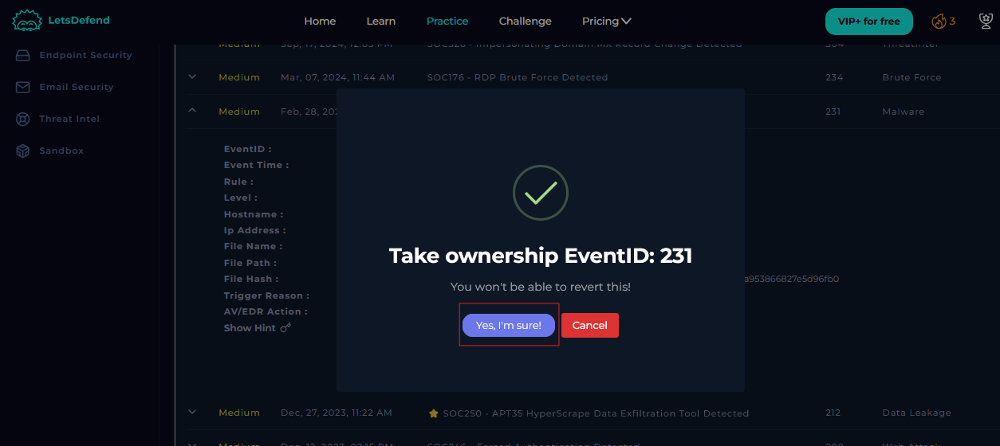
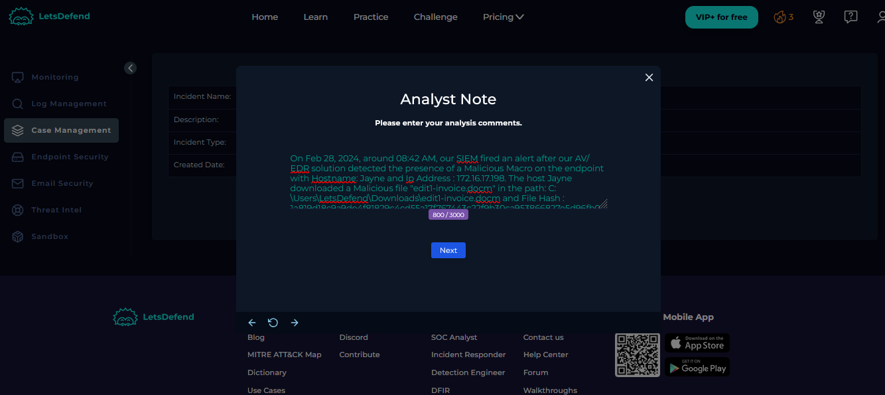

# SOC205---Malicious-Macro-has-been-executed

# Introduction
A malicious macro refers to a macro script embedded within a document (usually Microsoft Office files like .doc, .docm, .xls, or .xlsm) that performs harmful actions when the document is opened and macros are enabled.

## Investigation & Remediation
To investigate and remediate the alert, I took the following steps;
 - Check SOC ticket queue & Take ownership of an Alert
 - Create case
 - Understanding the attack
 - Detection
 - Analysis
 - Containment
 - Remediation
 - Report Artifacts & IOCs
 - Close ticket

These steps are expalined in details below with images.

## Step 1: Checking SOC Ticket Queue
The Security Operations Center (SOC) ticket queue is a critical component in managing and responding to cybersecurity incidents. The reasons are Incident Tracking and Management, Prioritization and Triage, Accountability, Reporting, Trend Analysis, and Compliance and Audit Readiness.

Each ticket in the queue is typically assigned to a specific analyst or team, ensuring clear responsibility and accountability for incident resolution. This fosters a structured and organized approach to incident management. I took ownership of the Alert with EventID: 231
 

  

 

  

## Step 2: Creating a Case
Upon taking ownership of the alert, it is automatically sent to the investigation channel, where I can initiate a case to further analyze and respond to the security incident. I created a case for the alert and was able to veiw details of the incident. 
 

  

## Step 3: Detection
Based on the information that the alert provided, it appears that the host "Jayne" with IP address "172.16.17.198" downloaded a malicious file with filename "edit1-invoice.docm" and file hash "1a819d18c9a9de4f81829c4cd55a17f767443c22f9b30ca953866827e5d96fb0a" to the path "C:\Users\LetsDefend\Downloads\edit1-invoice.docm". The Alert is triggered by the SOC205 - Malicious Macro has been executed and was detected by AV/EDR solution.

  

To gather Information as regards the file ""edit1-invoice.docm" and file hash "1a819d18c9a9de4f81829c4cd55a17f767443c22f9b30ca953866827e5d96fb0a", I used Ciscotalos and Virustotal to gather information as regards the nature of the downloaded Macro using the file hash.

  

Next, I also used virustotal to gather more information as regards the behaviour of the micro, From the information gathered in virustotal, I discovered the file was malicious in nature and likely in contact with a C2 IP: 92.204.221.16 . 

  

  

 
## Step 4: Analysis
I started my analysis by searching our log files with the C2 IP address 92.204.221.16 to see how many endpoint(s) have had any form of contact with it. The result of my search shows that only one end point with IP address 172.16.17.198 has communicated with the C2 center. 

  

Next, I opened the raw log and noticed a powershell was opened and and a process was started that tried to download an executable file Request: MESSBOX.EXE from the URL HTTP://WWW.GREYHATHACKER.NET/TOOLS/ MESSBOX.EXE. However, it seems the downloade failed because the HTTP code: 404 — File Not Found (resource not currently available on the server) was returned. However, I will took no chance and continued my investigation by analysing the affected endpoint.

  

Next, I proceeded to the log management page and filtered by log by the malicious source IP address 203.160.68.12 to see how many host have been in contact with it. Upon searching the network, I discovered only the host named “CP-Spark-Gateway-01” with an IP address of 172.16.20.146 has been in contact the the malicious IP.

  

## Step 5: Containment
Containment plays a pivotal role in cybersecurity by limiting the impact of security incidents, protecting data and operations, facilitating effective incident response, preserving evidence for forensic analysis, and ensuring compliance with legal and regulatory requirements.

Since I have detected that the device is compromised, I proceeded to isolated the endpoint with an IP address of 172.16.17.198 to prevent further damages. However, I could not find the device in the endpoint section. 

  

#Note I would have Isolated the device from the network and performed further investigation and remediation. For this task, since I could not find the endpoint, I assume I have successfully isolated the machine, escalating to Tier 2 and continue with the next step.

## Step 6: Remediation
Remediation is a fundamental component of a robust cybersecurity strategy. It involves fixing vulnerabilities and addressing security issues to prevent exploitation, protect data, maintain operations, and comply with regulations, ultimately contributing to a more secure and resilient organization. To remediate and prevent furture re occurence, the following steps should be taken;
 - Isolate the endpoint with IP address 172.16.17.198 for further investigation. 
 - Configure/write firewall rules to deny/block traffic from the malicious IP address 92.204.221.16.

## Step 7: Report Artifacts & IOCs
After completing the analysis, I documented my findings in the “Analyst Note” section, repoterd Artifacts & IOCs.

  

  

## Step : Closing the Alert
After concluding my investigation, I concluded that the alert is a true positive. I drafted a closing note explaining the cause of the alert, the steps i took to analyse the alert, the outcome of the analyses, step taken to remediate the alert and successfully close the alert. 

  

 

